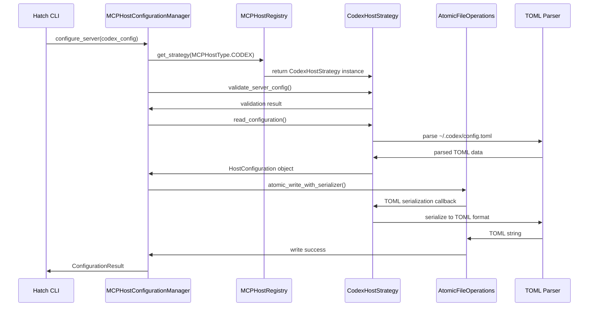
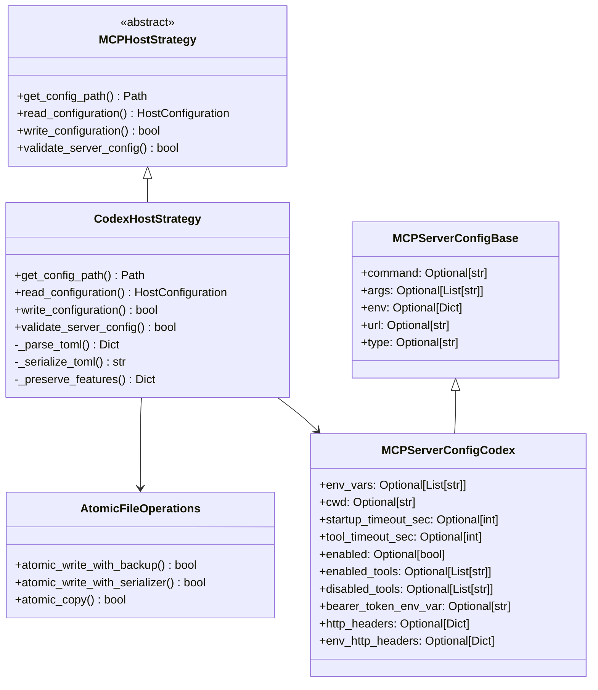

# Codex MCP Host Support Feasibility Analysis

## Executive Summary

**FEASIBILITY: ✅ HIGHLY FEASIBLE**

Adding Codex MCP host support to Hatch is highly feasible within the current architecture. The existing strategy pattern with decorator-based registration is excellently designed for format diversity, requiring only moderate enhancements to support TOML configuration files. No extensive refactoring is needed.

## Current Architecture Analysis

### Strategy Pattern Excellence

The MCP host configuration system uses a well-designed strategy pattern that perfectly accommodates format diversity:

```python
# hatch/mcp_host_config/strategies.py
@register_host_strategy(MCPHostType.CLAUDE_DESKTOP)
class ClaudeDesktopStrategy(ClaudeHostStrategy):
    def read_configuration(self) -> HostConfiguration: # Format-specific
    def write_configuration(self, config: HostConfiguration) -> bool: # Format-specific
```

**Key Architectural Strengths:**
- **Format Encapsulation**: Each strategy completely encapsulates its file format handling
- **Interface Consistency**: All strategies work with format-agnostic `HostConfiguration` objects
- **Automatic Registration**: Decorator system automatically discovers new host types
- **Family Inheritance**: Base classes (`ClaudeHostStrategy`, `CursorBasedHostStrategy`) enable code reuse

### Data Model Flexibility

The Pydantic model system is already designed for host-specific extensions:

```python
# hatch/mcp_host_config/models.py
class MCPServerConfigBase(BaseModel):
    # Universal fields: command, args, env, url, headers, type
    
class MCPServerConfigGemini(MCPServerConfigBase):
    # Gemini-specific: cwd, timeout, trust, oauth_* fields
    
class MCPServerConfigVSCode(MCPServerConfigBase):
    # VS Code-specific: envFile, inputs fields
```

**Pattern Compatibility:**
- `MCPServerConfigCodex` can extend `MCPServerConfigBase` following established patterns
- `HOST_MODEL_REGISTRY` already supports host-specific model mapping
- Pydantic validation works regardless of serialization format

### File Operations Infrastructure

Current file operations are JSON-focused but architecturally sound:

```python
# hatch/mcp_host_config/backup.py
class AtomicFileOperations:
    def atomic_write_with_backup(self, file_path: Path, data: Dict[str, Any], ...):
        # Currently hardcoded to json.dump()
```

**Infrastructure Assessment:**
- ✅ **Backup Creation**: Uses `shutil.copy2()` - format independent
- ✅ **Atomic Operations**: Core logic is format-agnostic
- ❌ **Serialization**: Hardcoded to JSON format
- ❌ **File Extensions**: Assumes `.json` in backup naming

## Codex Configuration Requirements

### TOML Structure Analysis

Codex uses TOML configuration at `~/.codex/config.toml`:

```toml
[features]
rmcp_client = true

[mcp_servers.context7]
command = "npx"
args = ["-y", "@upstash/context7-mcp"]
startup_timeout_sec = 10
tool_timeout_sec = 60
enabled = true
enabled_tools = ["tool1", "tool2"]

[mcp_servers.context7.env]
MY_VAR = "value"

[mcp_servers.figma]
url = "https://mcp.figma.com/mcp"
bearer_token_env_var = "FIGMA_OAUTH_TOKEN"
http_headers = { "X-Figma-Region" = "us-east-1" }
```

### Codex-Specific Fields

**Standard Fields** (already supported):
- `command`, `args`, `env` - Local server configuration
- `url` - Remote server configuration

**Codex-Specific Fields** (require new model):
- `env_vars: List[str]` - Environment variables to forward
- `cwd: str` - Working directory for server
- `startup_timeout_sec: int` - Server startup timeout
- `tool_timeout_sec: int` - Tool execution timeout
- `enabled: bool` - Enable/disable server
- `enabled_tools: List[str]` - Tool allowlist
- `disabled_tools: List[str]` - Tool denylist
- `bearer_token_env_var: str` - Bearer token environment variable
- `http_headers: Dict[str, str]` - Static HTTP headers
- `env_http_headers: Dict[str, str]` - HTTP headers from environment

**Global Configuration:**
- `[features].rmcp_client: bool` - Enable Rust MCP client

## Implementation Architecture

### Phase 1: Data Model Extension

```python
# hatch/mcp_host_config/models.py
class MCPHostType(str, Enum):
    # ... existing hosts ...
    CODEX = "codex"

class MCPServerConfigCodex(MCPServerConfigBase):
    """Codex-specific MCP server configuration."""
    
    # Codex-specific fields
    env_vars: Optional[List[str]] = Field(None, description="Environment variables to forward")
    cwd: Optional[str] = Field(None, description="Working directory")
    startup_timeout_sec: Optional[int] = Field(None, description="Server startup timeout")
    tool_timeout_sec: Optional[int] = Field(None, description="Tool execution timeout")
    enabled: Optional[bool] = Field(None, description="Enable/disable server")
    enabled_tools: Optional[List[str]] = Field(None, description="Tool allowlist")
    disabled_tools: Optional[List[str]] = Field(None, description="Tool denylist")
    
    # HTTP-specific fields
    bearer_token_env_var: Optional[str] = Field(None, description="Bearer token env var")
    http_headers: Optional[Dict[str, str]] = Field(None, description="Static HTTP headers")
    env_http_headers: Optional[Dict[str, str]] = Field(None, description="HTTP headers from env")

# Update registry
HOST_MODEL_REGISTRY[MCPHostType.CODEX] = MCPServerConfigCodex
```

### Phase 2: Strategy Implementation

```python
# hatch/mcp_host_config/strategies.py
@register_host_strategy(MCPHostType.CODEX)
class CodexHostStrategy(MCPHostStrategy):
    """Configuration strategy for Codex IDE with TOML support."""
    
    def get_config_path(self) -> Optional[Path]:
        return Path.home() / ".codex" / "config.toml"
    
    def read_configuration(self) -> HostConfiguration:
        # TOML parsing logic
        # Handle [mcp_servers.*] sections
        # Convert to HostConfiguration
    
    def write_configuration(self, config: HostConfiguration, no_backup: bool = False) -> bool:
        # Preserve [features] section
        # Convert HostConfiguration to TOML structure
        # Atomic TOML write operation
```

### Phase 3: Backup System Enhancement

```python
# hatch/mcp_host_config/backup.py
class AtomicFileOperations:
    def atomic_write_with_serializer(self, file_path: Path, data: Any, 
                                   serializer: Callable[[Any, TextIO], None],
                                   backup_manager: "MCPHostConfigBackupManager",
                                   hostname: str, skip_backup: bool = False) -> bool:
        # Generalized atomic write with custom serializer
        
    def atomic_write_with_backup(self, file_path: Path, data: Dict[str, Any], ...):
        # Backward compatibility wrapper using JSON serializer
```

## Technical Implementation Details

### TOML Serialization Strategy

```python
def _convert_to_toml_structure(self, config: HostConfiguration) -> Dict[str, Any]:
    """Convert HostConfiguration to Codex TOML structure."""
    toml_data = {}
    
    # Preserve existing [features] section
    if self._existing_features:
        toml_data["features"] = self._existing_features
    
    # Convert servers to [mcp_servers.*] sections
    toml_data["mcp_servers"] = {}
    for name, server_config in config.servers.items():
        server_dict = server_config.model_dump(exclude_none=True)
        
        # Handle nested env section
        if "env" in server_dict:
            env_data = server_dict.pop("env")
            toml_data["mcp_servers"][name] = server_dict
            toml_data["mcp_servers"][name]["env"] = env_data
        else:
            toml_data["mcp_servers"][name] = server_dict
    
    return toml_data
```

### Dependency Requirements

```python
# pyproject.toml
[project]
dependencies = [
    # ... existing dependencies ...
    "tomli-w>=1.0.0",  # TOML writing
    "tomli>=1.2.0; python_version<'3.11'",  # TOML reading for Python <3.11
]
```

## Risk Assessment

### Low Risk Components
- **Strategy Registration**: Existing decorator system handles new hosts automatically
- **Data Validation**: Pydantic models provide robust validation regardless of format
- **Interface Compatibility**: No changes to core interfaces required

### Medium Risk Components
- **TOML Serialization**: Need to handle nested structures and preserve global sections
- **Backup System**: Requires refactoring to support multiple formats
- **File Extension Handling**: Update backup naming for `.toml` files

### Mitigation Strategies
- **Comprehensive Testing**: Unit tests for TOML serialization/deserialization
- **Backward Compatibility**: Ensure existing JSON-based hosts remain unaffected
- **Incremental Implementation**: Phase-based approach allows validation at each step

## Architectural Workflow Diagram



## Class Relationship Diagram



## Conclusion

The current MCP host configuration architecture is excellently designed for extensibility. Adding Codex support with TOML configuration files requires:

1. **Minimal Changes**: Add enum value, create Codex-specific model, implement strategy
2. **Moderate Enhancements**: Generalize backup system for multi-format support
3. **No Refactoring**: Core interfaces and existing strategies remain unchanged

The strategy pattern's encapsulation of format-specific logic makes this extension natural and low-risk. The implementation follows established patterns and maintains architectural consistency.

**Recommendation**: Proceed with implementation using the phased approach outlined above.

---

**Analysis Date**: December 14, 2025  
**Architecture Version**: Current state as of analysis  
**Risk Level**: Low to Medium  
**Implementation Effort**: Moderate (estimated 2-3 development cycles)