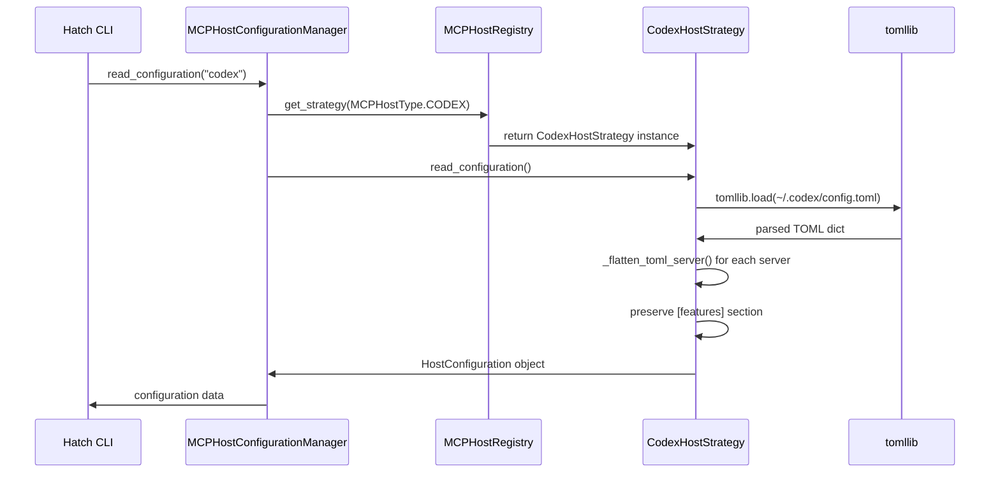
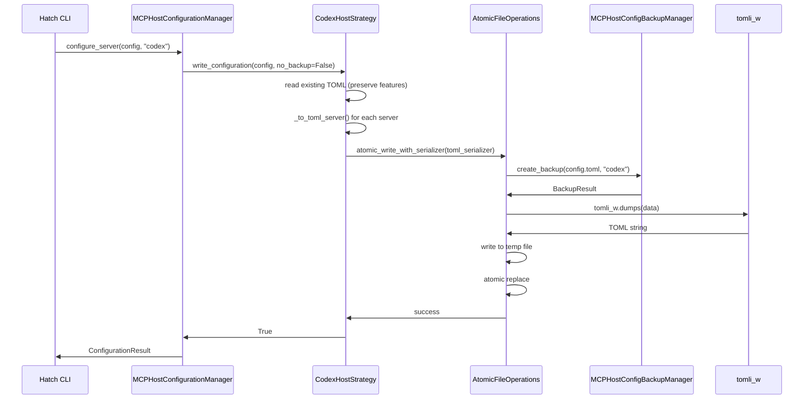
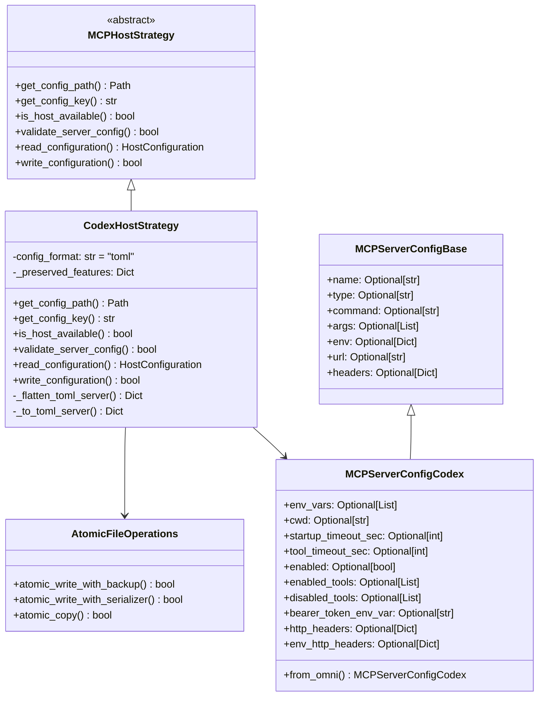

# Codex MCP Host Support - Implementation Architecture

## Overview

This report defines the implementation architecture for adding Codex MCP host configuration support to Hatch. Codex uses TOML configuration files (`~/.codex/config.toml`), which is the first non-JSON format in the MCP host configuration system.

**Key Challenge**: The current backup system (`AtomicFileOperations.atomic_write_with_backup()`) is hardcoded for JSON serialization. This requires architectural enhancement to support TOML.

## Integration Checklist

| Integration Point | Required | Files to Modify | Complexity |
|-------------------|----------|-----------------|------------|
| ☐ Host type enum | Always | `models.py` | Low |
| ☐ Backup hostname validation | Always | `backup.py` | Low |
| ☐ Strategy class | Always | `strategies.py` | Medium |
| ☐ Backup system enhancement | Always | `backup.py` | Medium |
| ☐ Host-specific model | Yes (unique fields) | `models.py` | Low |
| ☐ Omni model extension | Yes | `models.py` | Low |
| ☐ HOST_MODEL_REGISTRY | Yes | `models.py` | Low |
| ☐ TOML dependencies | Always | `pyproject.toml` | Low |
| ☐ Test infrastructure | Always | `tests/` | Medium |

## Architecture Components

### 1. TOML Dependency Addition

**File**: `pyproject.toml`

**Current State** (line 18-24):
```toml
dependencies = [
  "jsonschema>=4.0.0",
  "requests>=2.25.0",
  "packaging>=20.0",
  "docker>=7.1.0",
  "pydantic>=2.0.0",
  "hatch-validator>=0.8.0"
]
```

**Required Addition**:
```toml
dependencies = [
  # ... existing ...
  "tomli-w>=1.0.0",  # TOML writing (all Python versions)
]
```

**Note**: Python 3.11+ has built-in `tomllib` for reading TOML. Since `requires-python = ">=3.12"`, we only need `tomli-w` for writing.

### 2. Host Type Enum Extension

**File**: `hatch/mcp_host_config/models.py`

**Current State** (line 17-24):
```python
class MCPHostType(str, Enum):
    """Enumeration of supported MCP host types."""
    CLAUDE_DESKTOP = "claude-desktop"
    CLAUDE_CODE = "claude-code"
    VSCODE = "vscode"
    CURSOR = "cursor"
    LMSTUDIO = "lmstudio"
    GEMINI = "gemini"
    KIRO = "kiro"
```

**Required Addition**:
```python
class MCPHostType(str, Enum):
    """Enumeration of supported MCP host types."""
    # ... existing ...
    CODEX = "codex"
```

### 3. Backup System Hostname Validation Update

**File**: `hatch/mcp_host_config/backup.py`

**Current State** (line 32-38):
```python
@validator('hostname')
def validate_hostname(cls, v):
    """Validate hostname is supported."""
    supported_hosts = {
        'claude-desktop', 'claude-code', 'vscode', 
        'cursor', 'lmstudio', 'gemini', 'kiro'
    }
```

**Required Change**:
```python
@validator('hostname')
def validate_hostname(cls, v):
    """Validate hostname is supported."""
    supported_hosts = {
        'claude-desktop', 'claude-code', 'vscode', 
        'cursor', 'lmstudio', 'gemini', 'kiro', 'codex'
    }
```

### 4. Backup System Enhancement for Multi-Format Support

**File**: `hatch/mcp_host_config/backup.py`

**Current State** - `AtomicFileOperations.atomic_write_with_backup()` (line 82-117):
```python
def atomic_write_with_backup(self, file_path: Path, data: Dict[str, Any], 
                            backup_manager: "MCPHostConfigBackupManager", 
                            hostname: str, skip_backup: bool = False) -> bool:
    # ... backup logic ...
    with open(temp_file, 'w', encoding='utf-8') as f:
        json.dump(data, f, indent=2, ensure_ascii=False)  # Hardcoded JSON
```

**Required Enhancement** - Add format-agnostic method:
```python
from typing import Callable, TextIO

def atomic_write_with_serializer(
    self, 
    file_path: Path, 
    data: Any,
    serializer: Callable[[Any, TextIO], None],
    backup_manager: "MCPHostConfigBackupManager", 
    hostname: str, 
    skip_backup: bool = False
) -> bool:
    """Atomic write with custom serializer and automatic backup creation.
    
    Args:
        file_path: Target file path for writing
        data: Data to serialize and write
        serializer: Function that writes data to file handle
        backup_manager: Backup manager instance
        hostname: Host identifier for backup
        skip_backup: Skip backup creation
        
    Returns:
        bool: True if operation successful
        
    Raises:
        BackupError: If backup creation fails and skip_backup is False
    """
    # Create backup if file exists and backup not skipped
    backup_result = None
    if file_path.exists() and not skip_backup:
        backup_result = backup_manager.create_backup(file_path, hostname)
        if not backup_result.success:
            raise BackupError(f"Required backup failed: {backup_result.error_message}")
    
    temp_file = None
    try:
        temp_file = file_path.with_suffix(f"{file_path.suffix}.tmp")
        with open(temp_file, 'w', encoding='utf-8') as f:
            serializer(data, f)
        
        temp_file.replace(file_path)
        return True
        
    except Exception as e:
        if temp_file and temp_file.exists():
            temp_file.unlink()
        
        if backup_result and backup_result.backup_path:
            try:
                backup_manager.restore_backup(hostname, backup_result.backup_path.name)
            except Exception:
                pass
        
        raise BackupError(f"Atomic write failed: {str(e)}")

# Backward compatibility wrapper
def atomic_write_with_backup(self, file_path: Path, data: Dict[str, Any], 
                            backup_manager: "MCPHostConfigBackupManager", 
                            hostname: str, skip_backup: bool = False) -> bool:
    """Atomic write with JSON serialization (backward compatible)."""
    def json_serializer(data: Any, f: TextIO) -> None:
        json.dump(data, f, indent=2, ensure_ascii=False)
    
    return self.atomic_write_with_serializer(
        file_path, data, json_serializer, backup_manager, hostname, skip_backup
    )
```

### 5. Codex-Specific Configuration Model

**File**: `hatch/mcp_host_config/models.py`

**New Class** (add after `MCPServerConfigKiro` class, ~line 380):
```python
class MCPServerConfigCodex(MCPServerConfigBase):
    """Codex-specific MCP server configuration.
    
    Extends base model with Codex-specific fields including timeouts,
    tool filtering, environment variable forwarding, and HTTP authentication.
    """
    
    model_config = ConfigDict(extra="forbid")
    
    # Codex-specific STDIO fields
    env_vars: Optional[List[str]] = Field(
        None, 
        description="Environment variables to whitelist/forward"
    )
    cwd: Optional[str] = Field(
        None, 
        description="Working directory to launch server from"
    )
    
    # Timeout configuration
    startup_timeout_sec: Optional[int] = Field(
        None, 
        description="Server startup timeout in seconds (default: 10)"
    )
    tool_timeout_sec: Optional[int] = Field(
        None, 
        description="Tool execution timeout in seconds (default: 60)"
    )
    
    # Server control
    enabled: Optional[bool] = Field(
        None, 
        description="Enable/disable server without deleting config"
    )
    enabled_tools: Optional[List[str]] = Field(
        None, 
        description="Allow-list of tools to expose from server"
    )
    disabled_tools: Optional[List[str]] = Field(
        None, 
        description="Deny-list of tools to hide (applied after enabled_tools)"
    )
    
    # HTTP authentication fields
    bearer_token_env_var: Optional[str] = Field(
        None, 
        description="Name of env var containing bearer token for Authorization header"
    )
    http_headers: Optional[Dict[str, str]] = Field(
        None, 
        description="Map of header names to static values"
    )
    env_http_headers: Optional[Dict[str, str]] = Field(
        None, 
        description="Map of header names to env var names (values pulled from env)"
    )
    
    @classmethod
    def from_omni(cls, omni: 'MCPServerConfigOmni') -> 'MCPServerConfigCodex':
        """Convert Omni model to Codex-specific model."""
        supported_fields = set(cls.model_fields.keys())
        codex_data = omni.model_dump(include=supported_fields, exclude_unset=True)
        return cls.model_validate(codex_data)
```

### 6. Omni Model Extension

**File**: `hatch/mcp_host_config/models.py`

**Current State** - `MCPServerConfigOmni` class (~line 395-440):
```python
class MCPServerConfigOmni(BaseModel):
    # ... existing fields ...
    
    # Kiro specific
    disabled: Optional[bool] = None
    autoApprove: Optional[List[str]] = None
    disabledTools: Optional[List[str]] = None
```

**Required Addition** (add after Kiro-specific fields):
```python
    # Codex specific
    env_vars: Optional[List[str]] = None
    cwd: Optional[str] = None
    startup_timeout_sec: Optional[int] = None
    tool_timeout_sec: Optional[int] = None
    enabled: Optional[bool] = None
    enabled_tools: Optional[List[str]] = None
    disabled_tools: Optional[List[str]] = None
    bearer_token_env_var: Optional[str] = None
    http_headers: Optional[Dict[str, str]] = None
    env_http_headers: Optional[Dict[str, str]] = None
```

### 7. HOST_MODEL_REGISTRY Update

**File**: `hatch/mcp_host_config/models.py`

**Current State** (~line 450-458):
```python
HOST_MODEL_REGISTRY: Dict[MCPHostType, type[MCPServerConfigBase]] = {
    MCPHostType.GEMINI: MCPServerConfigGemini,
    MCPHostType.CLAUDE_DESKTOP: MCPServerConfigClaude,
    MCPHostType.CLAUDE_CODE: MCPServerConfigClaude,
    MCPHostType.VSCODE: MCPServerConfigVSCode,
    MCPHostType.CURSOR: MCPServerConfigCursor,
    MCPHostType.LMSTUDIO: MCPServerConfigCursor,
    MCPHostType.KIRO: MCPServerConfigKiro,
}
```

**Required Addition**:
```python
HOST_MODEL_REGISTRY: Dict[MCPHostType, type[MCPServerConfigBase]] = {
    # ... existing ...
    MCPHostType.CODEX: MCPServerConfigCodex,
}
```

### 8. Module Exports Update

**File**: `hatch/mcp_host_config/__init__.py`

**Current State** (line 7-11):
```python
from .models import (
    MCPHostType, MCPServerConfig, HostConfiguration, EnvironmentData,
    PackageHostConfiguration, EnvironmentPackageEntry, ConfigurationResult, SyncResult,
    MCPServerConfigBase, MCPServerConfigGemini, MCPServerConfigVSCode,
    MCPServerConfigCursor, MCPServerConfigClaude, MCPServerConfigKiro, MCPServerConfigOmni,
    HOST_MODEL_REGISTRY
)
```

**Required Change**:
```python
from .models import (
    MCPHostType, MCPServerConfig, HostConfiguration, EnvironmentData,
    PackageHostConfiguration, EnvironmentPackageEntry, ConfigurationResult, SyncResult,
    MCPServerConfigBase, MCPServerConfigGemini, MCPServerConfigVSCode,
    MCPServerConfigCursor, MCPServerConfigClaude, MCPServerConfigKiro, 
    MCPServerConfigCodex, MCPServerConfigOmni,
    HOST_MODEL_REGISTRY
)
```

And update `__all__`:
```python
__all__ = [
    # ... existing ...
    'MCPServerConfigCodex',
]
```

### 9. Codex Host Strategy Implementation

**File**: `hatch/mcp_host_config/strategies.py`

**New Class** (add at end of file):
```python
import tomllib  # Python 3.11+ built-in
import tomli_w  # For TOML writing

@register_host_strategy(MCPHostType.CODEX)
class CodexHostStrategy(MCPHostStrategy):
    """Configuration strategy for Codex IDE with TOML support.
    
    Codex uses TOML configuration at ~/.codex/config.toml with a unique
    structure using [mcp_servers.<server-name>] tables.
    """
    
    def __init__(self):
        self.config_format = "toml"
        self._preserved_features = {}  # Preserve [features] section
    
    def get_config_path(self) -> Optional[Path]:
        """Get Codex configuration path."""
        return Path.home() / ".codex" / "config.toml"
    
    def get_config_key(self) -> str:
        """Codex uses 'mcp_servers' key (note: underscore, not camelCase)."""
        return "mcp_servers"
    
    def is_host_available(self) -> bool:
        """Check if Codex is available by checking for config directory."""
        codex_dir = Path.home() / ".codex"
        return codex_dir.exists()
    
    def validate_server_config(self, server_config: MCPServerConfig) -> bool:
        """Codex validation - supports both STDIO and HTTP servers."""
        return server_config.command is not None or server_config.url is not None
    
    def read_configuration(self) -> HostConfiguration:
        """Read Codex TOML configuration file."""
        config_path = self.get_config_path()
        if not config_path or not config_path.exists():
            return HostConfiguration(servers={})
        
        try:
            with open(config_path, 'rb') as f:
                toml_data = tomllib.load(f)
            
            # Preserve [features] section for later write
            self._preserved_features = toml_data.get('features', {})
            
            # Extract MCP servers from [mcp_servers.*] tables
            mcp_servers = toml_data.get(self.get_config_key(), {})
            
            servers = {}
            for name, server_data in mcp_servers.items():
                try:
                    # Flatten nested env section if present
                    flat_data = self._flatten_toml_server(server_data)
                    servers[name] = MCPServerConfig(**flat_data)
                except Exception as e:
                    logger.warning(f"Invalid server config for {name}: {e}")
                    continue
            
            return HostConfiguration(servers=servers)
            
        except Exception as e:
            logger.error(f"Failed to read Codex configuration: {e}")
            return HostConfiguration(servers={})
    
    def write_configuration(self, config: HostConfiguration, no_backup: bool = False) -> bool:
        """Write Codex TOML configuration file with backup support."""
        config_path = self.get_config_path()
        if not config_path:
            return False
        
        try:
            config_path.parent.mkdir(parents=True, exist_ok=True)
            
            # Read existing configuration to preserve non-MCP settings
            existing_data = {}
            if config_path.exists():
                try:
                    with open(config_path, 'rb') as f:
                        existing_data = tomllib.load(f)
                except Exception:
                    pass
            
            # Preserve [features] section
            if 'features' in existing_data:
                self._preserved_features = existing_data['features']
            
            # Convert servers to TOML structure
            servers_data = {}
            for name, server_config in config.servers.items():
                servers_data[name] = self._to_toml_server(server_config)
            
            # Build final TOML structure
            final_data = {}
            
            # Preserve [features] at top
            if self._preserved_features:
                final_data['features'] = self._preserved_features
            
            # Add MCP servers
            final_data[self.get_config_key()] = servers_data
            
            # Preserve other top-level keys
            for key, value in existing_data.items():
                if key not in ('features', self.get_config_key()):
                    final_data[key] = value
            
            # Use atomic write with TOML serializer
            backup_manager = MCPHostConfigBackupManager()
            atomic_ops = AtomicFileOperations()
            
            def toml_serializer(data: Any, f: TextIO) -> None:
                # tomli_w.dump expects binary mode, so we need special handling
                toml_str = tomli_w.dumps(data)
                f.write(toml_str)
            
            atomic_ops.atomic_write_with_serializer(
                file_path=config_path,
                data=final_data,
                serializer=toml_serializer,
                backup_manager=backup_manager,
                hostname="codex",
                skip_backup=no_backup
            )
            
            return True
            
        except Exception as e:
            logger.error(f"Failed to write Codex configuration: {e}")
            return False
    
    def _flatten_toml_server(self, server_data: Dict[str, Any]) -> Dict[str, Any]:
        """Flatten nested TOML server structure to flat dict.
        
        TOML structure:
            [mcp_servers.name]
            command = "npx"
            args = ["-y", "package"]
            [mcp_servers.name.env]
            VAR = "value"
        
        Becomes:
            {"command": "npx", "args": [...], "env": {"VAR": "value"}}
        """
        # TOML already parses nested tables into nested dicts
        # So [mcp_servers.name.env] becomes {"env": {...}}
        return dict(server_data)
    
    def _to_toml_server(self, server_config: MCPServerConfig) -> Dict[str, Any]:
        """Convert MCPServerConfig to TOML-compatible dict structure."""
        data = server_config.model_dump(exclude_unset=True)
        
        # Remove 'name' field as it's the table key in TOML
        data.pop('name', None)
        
        return data
```

## TOML Structure Mapping

### Codex TOML Format

```toml
[features]
rmcp_client = true

[mcp_servers.context7]
command = "npx"
args = ["-y", "@upstash/context7-mcp"]
startup_timeout_sec = 10
tool_timeout_sec = 60
enabled = true

[mcp_servers.context7.env]
MY_VAR = "value"

[mcp_servers.figma]
url = "https://mcp.figma.com/mcp"
bearer_token_env_var = "FIGMA_OAUTH_TOKEN"
http_headers = { "X-Figma-Region" = "us-east-1" }
```

### Internal Representation

```python
HostConfiguration(
    servers={
        "context7": MCPServerConfig(
            command="npx",
            args=["-y", "@upstash/context7-mcp"],
            env={"MY_VAR": "value"},
            # Codex-specific fields via MCPServerConfigCodex
        ),
        "figma": MCPServerConfig(
            url="https://mcp.figma.com/mcp",
            # HTTP-specific fields
        )
    }
)
```

## Workflow Diagrams

### Configuration Read Flow



### Configuration Write Flow



## Class Hierarchy



## Implementation Tasks

### Task 1: Add TOML Dependency
- **File**: `pyproject.toml`
- **Change**: Add `tomli-w>=1.0.0` to dependencies
- **Risk**: Low
- **Dependencies**: None

### Task 2: Add MCPHostType.CODEX
- **File**: `hatch/mcp_host_config/models.py`
- **Change**: Add enum value
- **Risk**: Low
- **Dependencies**: None

### Task 3: Update Backup Hostname Validation
- **File**: `hatch/mcp_host_config/backup.py`
- **Change**: Add 'codex' to supported_hosts set
- **Risk**: Low
- **Dependencies**: Task 2

### Task 4: Enhance AtomicFileOperations
- **File**: `hatch/mcp_host_config/backup.py`
- **Change**: Add `atomic_write_with_serializer()` method
- **Risk**: Medium (affects backup system)
- **Dependencies**: None

### Task 5: Create MCPServerConfigCodex Model
- **File**: `hatch/mcp_host_config/models.py`
- **Change**: Add new Pydantic model class
- **Risk**: Low
- **Dependencies**: None

### Task 6: Extend MCPServerConfigOmni
- **File**: `hatch/mcp_host_config/models.py`
- **Change**: Add Codex-specific fields
- **Risk**: Low
- **Dependencies**: Task 5

### Task 7: Update HOST_MODEL_REGISTRY
- **File**: `hatch/mcp_host_config/models.py`
- **Change**: Add Codex model mapping
- **Risk**: Low
- **Dependencies**: Task 2, Task 5

### Task 8: Update Module Exports
- **File**: `hatch/mcp_host_config/__init__.py`
- **Change**: Export MCPServerConfigCodex
- **Risk**: Low
- **Dependencies**: Task 5

### Task 9: Implement CodexHostStrategy
- **File**: `hatch/mcp_host_config/strategies.py`
- **Change**: Add complete strategy class with TOML handling
- **Risk**: Medium (new file format)
- **Dependencies**: Task 2, Task 4

### Task 10: Create Test Infrastructure
- **Files**: `tests/regression/test_mcp_codex_*.py`
- **Change**: Add comprehensive test suite
- **Risk**: Low
- **Dependencies**: All above tasks

## Risk Assessment

| Risk | Likelihood | Impact | Mitigation |
|------|------------|--------|------------|
| TOML serialization edge cases | Medium | Medium | Comprehensive test coverage |
| Backup system regression | Low | High | Backward-compatible wrapper method |
| [features] section corruption | Medium | Medium | Explicit preservation logic |
| Nested env table handling | Medium | Low | Explicit flatten/unflatten methods |

## Success Criteria

1. ✅ `MCPHostType.CODEX` registered and discoverable
2. ✅ `CodexHostStrategy` reads existing `config.toml` correctly
3. ✅ `CodexHostStrategy` writes valid TOML preserving [features]
4. ✅ Backup system creates/restores TOML backups
5. ✅ All existing JSON-based hosts unaffected
6. ✅ Test coverage for all Codex-specific functionality

---

**Analysis Date**: December 15, 2025  
**Architecture Version**: Based on current codebase state  
**Estimated Implementation Effort**: 3-4 development cycles