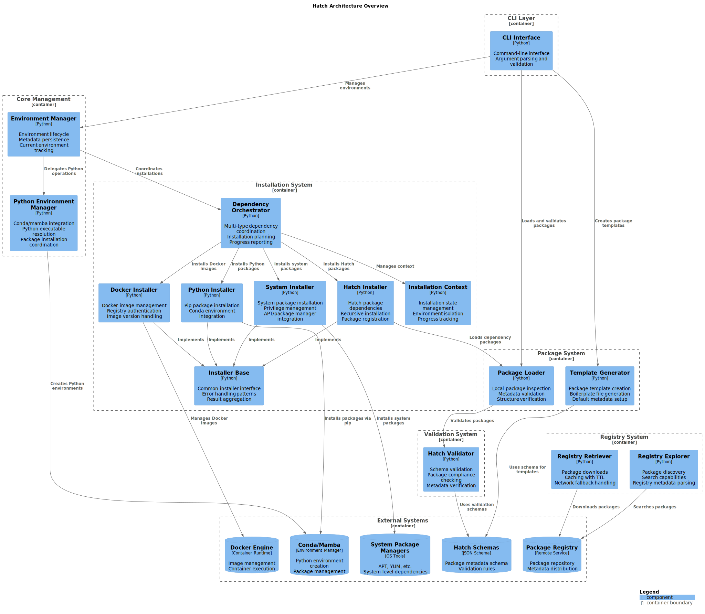

# Component Architecture

This article is about:

- Detailed breakdown of major system components and their responsibilities
- Component relationships and data flow patterns
- Extension points and configuration options

## Core Components

### Environment Management Components

#### HatchEnvironmentManager (`hatch/environment_manager.py`)

**Responsibilities:**

- Core functionality for managing isolated environments
- Environment lifecycle and state management
- Delegates package installation to the DependencyInstallerOrchestrator
- Manages environment metadata and persistence

**Key Features:**

- Environment creation, removal, and listing
- Current environment tracking
- Environment metadata persistence
- Integration with package installation system

#### PythonEnvironmentManager (`hatch/python_environment_manager.py`)

**Responsibilities:**

- Specialized management of Python environments via conda/mamba
- Python version detection and environment creation
- Python executable resolution and shell access
- Integration with system conda/mamba installations

**Key Features:**

- Automatic conda/mamba detection
- Python environment creation and management
- Environment diagnostic capabilities
- Shell integration for environment activation

### Package System Components

#### PackageLoader (`hatch/package_loader.py`)

**Responsibilities:**

- Loads and parses Hatch package metadata from local directories
- Validates package structure and metadata compliance
- Provides package inspection capabilities for CLI operations

**Key Features:**

- Package metadata loading and validation
- Package structure verification
- Local package installation support
- Integration with validation system

#### TemplateGenerator (`hatch/template_generator.py`)

**Responsibilities:**

- Generates complete package templates with standard structure
- Creates boilerplate files including entry points and metadata
- Orchestrates template creation process for `hatch create` command

**Key Features:**

- Standard package template generation
- Customizable package metadata
- Boilerplate file creation
- Template validation

### Registry System Components

#### RegistryRetriever (`hatch/registry_retriever.py`)

**Responsibilities:**

- Handles registry interactions and package retrieval
- Implements caching strategies with configurable TTL
- Manages network fallback and error handling

**Key Features:**

- Package download and caching
- TTL-based cache management
- Network fallback strategies
- Registry authentication support

#### RegistryExplorer (`hatch/registry_explorer.py`)

**Responsibilities:**

- Provides registry exploration and search capabilities
- Handles registry metadata parsing and package discovery
- Supports different registry sources and formats

**Key Features:**

- Package search and discovery
- Registry metadata parsing
- Multiple registry source support
- Package relationship analysis

### CLI Components

#### Entry Point (`hatch/cli/__main__.py`)

**Responsibilities:**

- Command-line argument parsing and validation
- Manager initialization and dependency injection
- Command routing to appropriate handler modules
- Top-level error handling and exit code management

**Key Features:**

- Custom `HatchArgumentParser` with formatted error messages
- Shared manager instances (HatchEnvironmentManager, MCPHostConfigurationManager)
- Modular command routing to handler modules
- Consistent argument structure across all commands

#### Handler Modules (`hatch/cli/cli_*.py`)

**Responsibilities:**

- Domain-specific command implementation
- Business logic orchestration using managers
- User interaction and confirmation prompts
- Output formatting using shared utilities

**Handler Modules:**

- **cli_env.py** - Environment lifecycle and Python environment operations
- **cli_package.py** - Package installation, removal, and synchronization
- **cli_mcp.py** - MCP host configuration, discovery, and backup
- **cli_system.py** - System-level operations (package creation, validation)

**Key Features:**

- Consistent handler signature: `(args: Namespace) -> int`
- Unified output formatting via ResultReporter
- Dry-run mode support for mutation commands
- Confirmation prompts for destructive operations

#### Shared Utilities (`hatch/cli/cli_utils.py`)

**Responsibilities:**

- Unified output formatting infrastructure
- Color system with true color support and TTY detection
- Table formatting for list commands
- Error formatting and validation utilities

**Key Components:**

- **Color System** - HCL color palette with semantic mapping
- **ConsequenceType** - Dual-tense action labels (prompt/result)
- **ResultReporter** - Unified rendering for mutation commands
- **TableFormatter** - Aligned table output for list commands
- **Error Formatting** - Structured validation and error messages

**Key Features:**

- Respects NO_COLOR environment variable
- True color (24-bit) with 16-color fallback
- Consistent output across all commands
- Nested consequence support (resource → field level)

### Installation System Components

#### DependencyInstallerOrchestrator (`hatch/installers/dependency_installation_orchestrator.py`)

**Responsibilities:**

- Coordinates multi-type dependency installation
- Manages installation planning and execution
- Provides progress reporting and error aggregation

**Key Features:**

- Multi-type dependency coordination
- Installation planning and optimization
- Progress tracking and reporting
- Error handling and recovery

#### InstallationContext (`hatch/installers/installation_context.py`)

**Responsibilities:**

- Manages installation context and state
- Tracks installation progress and results
- Provides installer-specific context data

**Key Features:**

- Installation state management
- Progress callback mechanisms
- Context data storage
- Installation result tracking

#### Installer Framework (`hatch/installers/`)

**Base Interface:** `installer_base.py`

- Defines common installer interface and base functionality
- Provides consistent API surface for all installer types
- Handles common error scenarios and logging

**Specialized Installers:**

- **PythonInstaller** - Python package installation via pip
- **SystemInstaller** - System package installation via package managers
- **DockerInstaller** - Docker image dependency management
- **HatchInstaller** - Hatch package dependency installation

## Component Data Flow

### CLI Command Flow

`User Input → __main__.py (Argument Parsing) → Handler Module → Manager(s) → Business Logic → ResultReporter → User Output`

1. User executes CLI command with arguments
2. `__main__.py` parses arguments using argparse
3. Managers (HatchEnvironmentManager, MCPHostConfigurationManager) are initialized
4. Command is routed to appropriate handler module
5. Handler orchestrates business logic using manager methods
6. ResultReporter formats output with consistent styling
7. Exit code returned to shell

### Environment Creation Flow

`CLI Command → HatchEnvironmentManager → PythonEnvironmentManager → Environment Metadata`

1. CLI parses environment creation command and options
2. HatchEnvironmentManager creates environment structure and metadata
3. PythonEnvironmentManager optionally creates Python environment
4. Environment metadata is persisted for future operations

### Package Installation Flow

`CLI Command → PackageLoader → DependencyInstallerOrchestrator → Specialized Installers → InstallationContext`

1. PackageLoader reads and validates package metadata
2. DependencyInstallerOrchestrator analyzes dependencies and creates installation plan
3. Specialized installers handle different dependency types in parallel
4. InstallationContext tracks installation state and progress
5. Package is registered in environment metadata

### Registry Operations Flow

`CLI Command → RegistryExplorer → RegistryRetriever → Local Cache → Package Operations`

1. RegistryExplorer discovers and searches available packages
2. RegistryRetriever handles network operations and caching
3. Local cache is maintained with configurable TTL
4. Fallback strategies handle network issues and offline operation

## Design Patterns in Components

### Strategy Pattern Implementation

- **Installer Framework**: Different installers implement common interface
- **Registry Retrieval**: Multiple strategies for different registry types
- **Python Environment Detection**: Support for multiple environment managers

### Template Method Pattern Implementation

- **Installation Orchestration**: Defines workflow while allowing installer-specific implementation
- **Package Template Generation**: Standard structure with customizable content
- **Environment Management**: Common lifecycle with specialized implementations

### Factory Pattern Implementation

- **Template Generator**: Creates packages with consistent structure
- **Installation Context**: Creates appropriate installer instances
- **Environment Creation**: Factory methods for different environment types

## Extension Points

### Adding New Installer Types

**Extension Process:**

1. Implement `InstallerBase` interface in new installer class
2. Register installer with `DependencyInstallerOrchestrator`
3. Add metadata schema support for new dependency type
4. Update documentation and tests

**Key Interfaces:**

- `install_dependency()` - Core installation logic
- `can_handle_dependency()` - Dependency type detection
- `get_dependency_type()` - Type identification

### Registry Integration Extensions

**Extension Process:**

1. Extend `RegistryRetriever` for new registry sources
2. Implement appropriate caching strategy
3. Add error handling and fallback mechanisms
4. Update `RegistryExplorer` for new discovery methods

### Python Environment Support Extensions

**Extension Process:**

1. Extend `PythonEnvironmentManager` detection capabilities
2. Add new environment manager implementations
3. Update diagnostic and shell integration capabilities

## Configuration Points

### Environment Configuration

- **Environment Storage Directory** (`--envs-dir`) - Where environments are stored
- **Environment Metadata** - Persistent environment state and package tracking

### Cache Configuration

- **Cache Directory** (`--cache-dir`) - Local cache storage location
- **Cache TTL** (`--cache-ttl`) - Time-to-live for cached registry data
- **Cache Strategy** - Configurable caching behavior

### Registry Configuration

- **Registry Endpoints** - Primary and fallback registry URLs
- **Authentication** - Registry access credentials and tokens
- **Fallback Behavior** - Offline operation and error handling

### Python Environment Configuration

- **Manager Preferences** - Conda vs. mamba preference
- **Python Version Detection** - Automatic vs. explicit version selection
- **Environment Activation** - Shell integration preferences

## Component Testing Strategy

### Unit Testing

- Individual component testing with mocked dependencies
- Interface compliance testing for extensible components
- Error condition and edge case testing

### Integration Testing

- Component interaction testing
- End-to-end workflow validation
- External dependency integration testing

### Simulation Testing

- Offline operation testing
- Network failure simulation
- Cache behavior validation

## Related Documentation

- [System Overview](./system_overview.md) - High-level architecture introduction
- [CLI Architecture](./cli_architecture.md) - Detailed CLI design and patterns
- [Implementation Guides](../implementation_guides/index.md) - Technical implementation guidance for specific components
- [Development Processes](../development_processes/index.md) - Development workflow and testing standards
